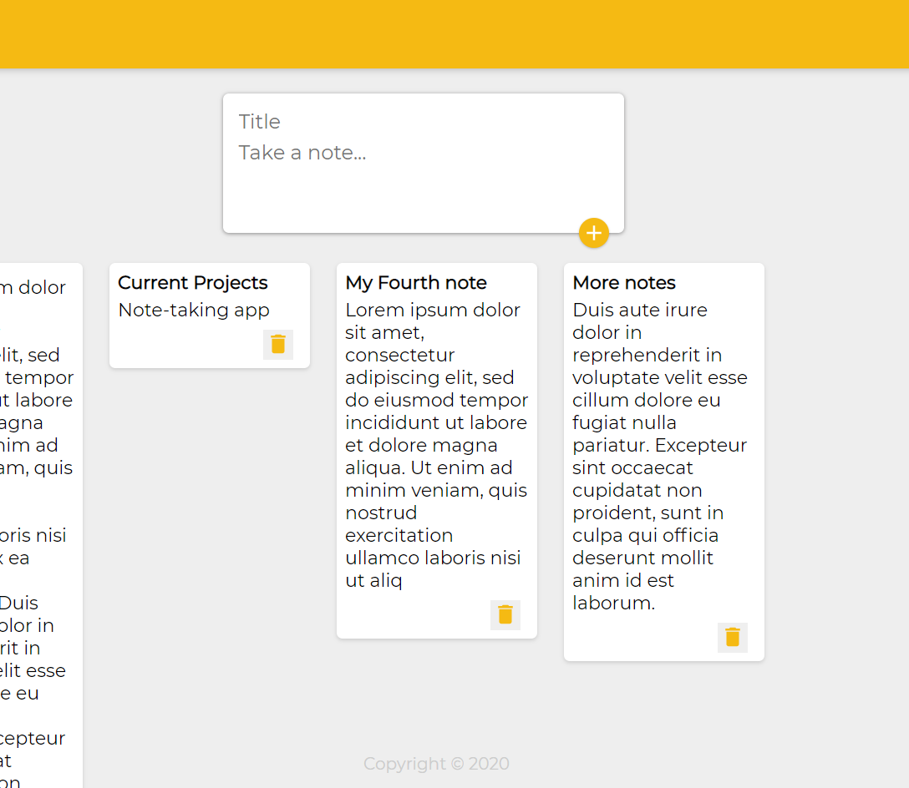

# Note-taking App

---

This is a note taking app, made using React, inspired by Google Keep.

The user can create a note with a title and content and the note will appear under the textbox in order of creation. The note includes a button to delete the respective note.

## To-do

Currently the notes created are just stored in a variable so they will all disappear when closing and running the app again. I will need to implement a database to store the notes into.
